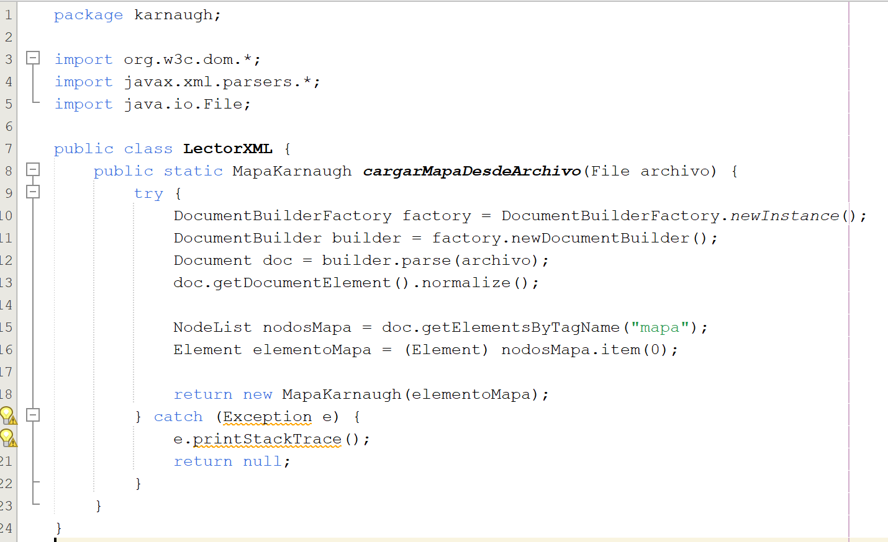
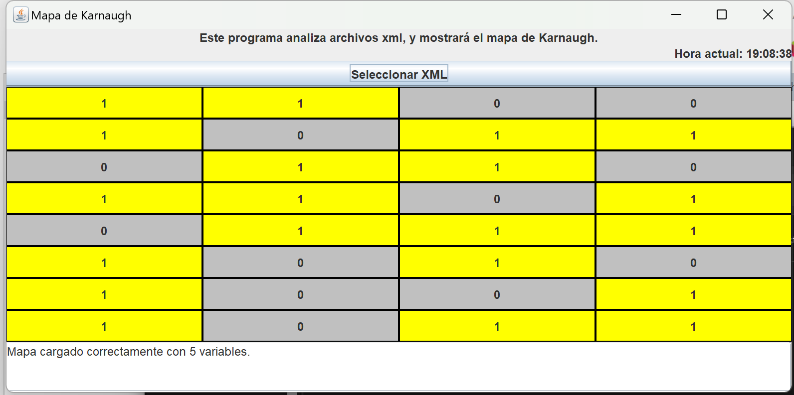

# UNIVERSIDAD SAN CARLOS DE GUATEMALA
FACULTAD DE INGENIERÍA  
MATEMATICA PARA COMPUTACIÓN 1  
SECCION “C” 

## Autores
Eldan Andre Escobar Asturias – Carnet: 202303088  
Keneth Alexander Lopez Barrios – Carnet: 202307542
 
---

## Indice
- Introduccion    ......................................................................................1
- Objetivos    .........................................................................................2
- Marco Teorico    .....................................................................................3
- DescripcionDelProblema    ............................................................................4
- Introduccion    ......................................................................................5
- Algoritmo    .........................................................................................6
- DiagramaDeFlujo    ...................................................................................7
- Pseudocodigo    ......................................................................................8
- Implementacion    ....................................................................................9
- Mockups    ...........................................................................................10
- Conclusiones   .......................................................................................11
- Referencias    .......................................................................................12
---

## Introducción

Este documento presenta el desarrollo de una herramienta de software orientada a la generación de mapas de Karnaugh. La aplicación permite importar archivos XML que definen las configuraciones para mapas de 3, 4 o 5 variables. Adicionalmente, calcula el número aproximado de compuertas lógicas necesarias para la implementación física del circuito.

El propósito central de esta solución es agilizar y optimizar el proceso de simplificación lógica, proporcionando una representación visual intuitiva del mapa y destacando los pasos clave durante la minimización. De esta manera, la herramienta busca ser un recurso valioso tanto para fines educativos como para el desarrollo eficiente de diseños digitales, combinando automatización con claridad en la presentación de resultados.

---

## Objetivos

- Objetivo general: Desarrollar un software con interfaz gráfica que permita leer archivos XML para generar mapas de Karnaugh de 3, 4 y 5 variables.
- Objetivos específicos:
  1. Carga y procesamiento de datos: Desarrollar un sistema capaz de interpretar archivos en formato .xml que almacenen la información necesaria para construir mapas de Karnaugh.
  2. Estimación de recursos en circuitos: Calcular el número aproximado de compuertas lógicas requeridas para materializar el circuito digital, facilitando el análisis de complejidad y costos.
  3. Visualización interactiva: Crear una interfaz gráfica intuitiva que muestre el mapa de Karnaugh y las etapas de simplificación realizadas, permitiendo un seguimiento claro del proceso.

---

## Marco Teórico

Durante el desarrollo de este proyecto fue fundamental comprender a profundidad el funcionamiento de las funciones booleanas, ya que son la base de la lógica digital. Estas funciones, compuestas por variables binarias y operadores lógicos como AND, OR y NOT, permiten representar el comportamiento de sistemas electrónicos. Una de las herramientas más útiles para simplificarlas de forma visual es el mapa de Karnaugh, el cual agrupando valores iguales (normalmente 1s) permite reducir una expresión lógica a su forma más simple.

Implementar esta técnica en un software significó entender no solo la teoría detrás del método, sino también cómo transformarla en un proceso automatizado. Se trabajó con mapas de 3, 4 y 5 variables, lo que implicó diseñar estructuras internas capaces de adaptarse a diferentes configuraciones. Personalmente, el manejo de mapas de 5 variables fue el más desafiante, ya que requieren una representación en dos bloques y reglas de agrupamiento más complejas.

Para facilitar la entrada de datos, se optó por usar archivos XML, debido a su formato estructurado y fácil interpretación por el sistema. Estos archivos contienen la información necesaria para construir el mapa, como el número de variables y la disposición de los valores. Se programó un lector que interpreta el XML, valida su estructura y lo transforma en datos útiles para el resto del sistema.

Una vez que se genera el mapa, el software aplica un algoritmo de simplificación que identifica las posibles agrupaciones y genera automáticamente la función booleana tanto en su forma canónica como en su versión mínima. Posteriormente, el sistema estima la cantidad de compuertas lógicas necesarias para construir el circuito equivalente, conectando la parte lógica con una posible implementación física del diseño.

Un componente clave del proyecto fue la interfaz gráfica, ya que queríamos que el usuario pudiera interactuar con el sistema de forma visual e intuitiva. Se diseñó una GUI donde se pueden cargar los archivos XML, observar el mapa de Karnaugh, seguir los pasos de simplificación y ver el resultado final. Durante las pruebas, se hizo especial énfasis en que la interfaz fuera clara incluso para quienes están comenzando a aprender lógica digital.  

En general, este proyecto representa una aplicación práctica de varios conocimientos: desde la lógica booleana hasta el manejo de archivos estructurados, pasando por la visualización gráfica y el diseño de algoritmos. Más allá del desarrollo técnico, el objetivo fue crear una herramienta que pueda ser útil tanto en el ámbito educativo como profesional, ayudando a simplificar procesos que suelen hacerse manualmente y que, gracias a la tecnología, ahora pueden resolverse con mayor rapidez y precisión.

---

## Descripcion del problema

En el diseño de circuitos digitales, la simplificación de funciones booleanas es fundamental para optimizar el rendimiento y minimizar el uso de componentes. Sin embargo, cuando esta tarea se realiza manualmente mediante mapas de Karnaugh - especialmente en sistemas de 4 o 5 variables - surgen varios desafíos: el proceso se vuelve tedioso, consume tiempo considerable y es propenso a errores humanos.

Si bien actualmente existen herramientas digitales que asisten en este proceso, la mayoría presenta limitaciones significativas. Muchas soluciones carecen de la capacidad de importar configuraciones desde archivos XML, un formato ampliamente utilizado en ingeniería. Además, numerosos programas no ofrecen una visualización clara del proceso de simplificación, dejando al usuario sin comprender cómo se llegó al resultado final.

---

## Algoritmo
Inicio

1. Mostrar mensaje: "Seleccione el archivo XML"
2. Leer archivo XML seleccionado por el usuario

3. Verificar que el archivo XML sea válido  
   Si el archivo no es válido:  
      Mostrar error y terminar  
   FinSi

4. Obtener del XML:  
   - Número de variables (3, 4 o 5)  
   - Lista de posiciones con valor 1 (minterms)

5. Generar estructura del mapa de Karnaugh según el número de variables

6. Colocar los valores (1s) en el mapa según los minterms

7. Mostrar visualmente el mapa de Karnaugh en la interfaz gráfica  
   - Se muestran colores para identificar grupos o valores

8. Aplicar algoritmo de simplificación

Fin

---

## Diagrama de flujo

---

## Pseudocodigo

---

## Implementación del Algoritmo a nivel de código

 

---

## Mockups del software

---

## Conclusion

La creación de esta herramienta para generar y simplificar mapas de Karnaugh ha demostrado ser una solución útil frente a las complicaciones del proceso manual en el diseño de circuitos lógicos. Gracias al uso de archivos XML y a una interfaz gráfica sencilla, se logró automatizar una tarea que suele ser repetitiva y propensa a errores, haciendo más accesible su aplicación tanto en el ámbito académico como en el profesional. Además, el proyecto permitió aplicar varios conocimientos adquiridos durante el curso, combinando teoría y práctica en un desarrollo funcional. En resumen, esta herramienta facilita el estudio de la lógica digital y aporta una alternativa eficiente para quienes trabajan con funciones booleanas y necesitan optimizar su implementación.

---

## Referencias
- YouTube (s.f.). Curso de Álgebra Booleana y Mapas de Karnaugh [Lista de reproducción]. Recuperado de https://www.youtube.com/playlist?list=PLaqk-0HitZXH20WZpkWYSGF4sxfU-wcj

- YouTube (s.f.). Explicación paso a paso sobre mapas de Karnaugh [Video]. Recuperado de https://www.youtube.com/watch?v=U709qY6S9rA&list=PLU8oAlHdN5BktAXdEVCLUVzvDygRQJ2lk

- Apache NetBeans (s.f.). Descargar NetBeans IDE. Recuperado de https://netbeans.apache.org/front/main/download/

- YouTube (s.f.). Curso de programación JAVA desde cero [Lista de reproducción]. Recuperado de https://www.youtube.com/watch?v=L1oMLsiMusQ&list=PLyvsggKtwbLX9LrDnl1-K6QtYo7m0yXWB&ab_channel=LaGeekipediaDeErnesto

